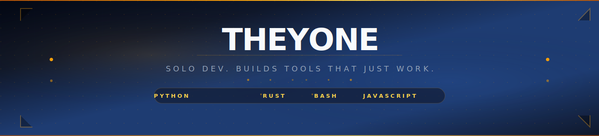
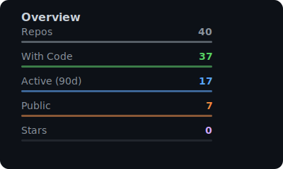
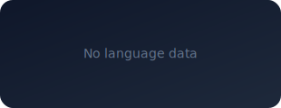
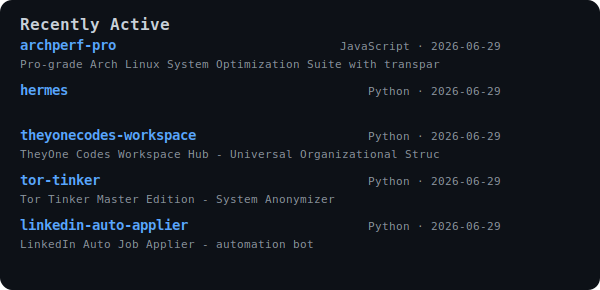

<!-- ═══════════════════════════════════════════════════════════
     THEYONE — Profile
     Built with: pure markdown + SVG assets
     ═══════════════════════════════════════════════════════════ -->

<!-- Hero -->

<!-- Typing -->

<!-- Divider -->

  <svg width="200" height="16" viewBox="0 0 200 16">
    <circle cx="8" cy="8" r="3" fill="#f59e0b" opacity="0.6"/>
    <line x1="24" y1="8" x2="176" y2="8" stroke="#f59e0b" stroke-width="1" stroke-dasharray="3 4" opacity="0.5"/>
    <circle cx="192" cy="8" r="3" fill="#f59e0b" opacity="0.6"/>
  </svg>

## What I Do

Tools that just work. No dependencies, no account signup, no cloud dependency. I build what I need, ship it when it's ready, and improve it over time.

Private repos hold the backlog — ideas in folders, projects scaffolded and waiting.

---

## Projects

<!-- CISO-Auditor -->

**🛡️ CISO-Auditor** · Windows Security Audit

Security tools are either **$10K/year** or too complex for solo consultants.

→ 100-point offline audit engine with **raw bytecode PDF exports** + **System Restore hooks**. One script, no install, runs anywhere.

`Python` · Zero deps · Portable exe · PDF export

<a href="https://github.com/theyonecodes/CISO-Auditor" style="display:inline-block; margin-top:12px; color:#60a5fa; text-decoration:none; font-size:13px; font-weight:600;">View Project →</a>

<!-- archperf-pro -->

**⚡ archperf-pro** · System Optimization

Generic optimization scripts ignore how you actually use your machine.

→ Pro-grade Arch Linux tuning that **learns your behavior** via Hidden Markov Models + Q-Learning. Real telemetry, not guesswork.

`JavaScript` · HMM · Q-Learning · PID control

<a href="https://github.com/theyonecodes/archperf-pro" style="display:inline-block; margin-top:12px; color:#f472b6; text-decoration:none; font-size:13px; font-weight:600;">View Project →</a>

<!-- pkgdrop -->

**📦 pkgdrop** · Universal Package Installer

Installing packages outside `apt`/`pacman` is a pain. Arch AUR helpers, deb/rpm from anywhere, AppImages — none of it talks to each other.

→ One command installs **deb, rpm, AppImage, tar.xz, pkg.tar.zst**. GPG verified, atomic installs, instant rollback.

`Bash` · 2,338 LOC · GPG · Atomic

<a href="https://github.com/theyonecodes/pkgdrop" style="display:inline-block; margin-top:12px; color:#fbbf24; text-decoration:none; font-size:13px; font-weight:600;">View Project →</a>

<!-- theyonepm -->

**📋 theyonepm** · Project Tracker

Every PM tool is either enterprise bloat or cloud-only. And none work with AI agents.

→ Single HTML file. No backend, no signup. Built for humans and AI to both use. IndexedDB for storage, OKLCH colors, Fibonacci spacing.

`HTML` · 8K LOC · IndexedDB · AI-native

<a href="https://github.com/theyonecodes/theyonepm" style="display:inline-block; margin-top:12px; color:#34d399; text-decoration:none; font-size:13px; font-weight:600;">View Project →</a>

<!-- More repos link -->

  <a href="https://github.com/theyonecodes?tab=repositories" style="color:#64748b; text-decoration:none; font-size:13px; font-weight:500; border:1px solid #334155; padding:8px 20px; border-radius:8px; display:inline-block; transition:all 0.2s;" onmouseover="this.style.borderColor='#f59e0b';this.style.color='#f59e0b'" onmouseout="this.style.borderColor='#334155';this.style.color='#64748b'">See all repositories →</a>

---

## Stack

| Systems & Kernel | Security | Automation | Web | Design |
|:--|:--|:--|:--|:--|
| Linux · Windows | Audit · FDE · FSB | Python · Rust | Flask · React | OKLCH · CSS |

  

---

## Live Stats

  
  
    
  

---

<!-- Footer -->

  

  Empty repos are backlogged ideas — not abandoned projects.

<!-- Hidden palette ref -->

.
