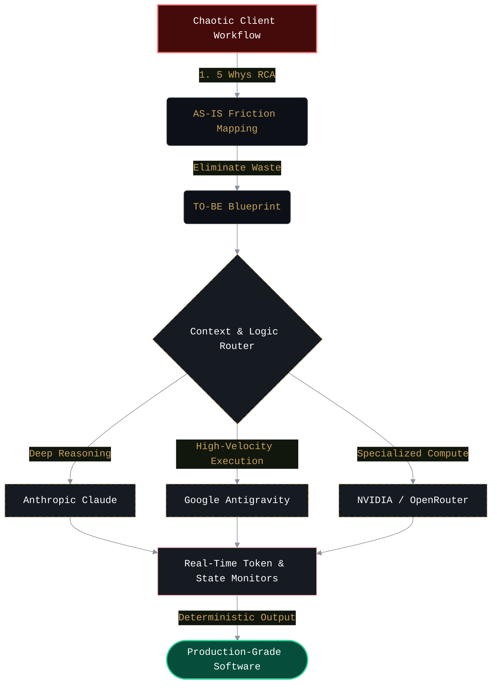
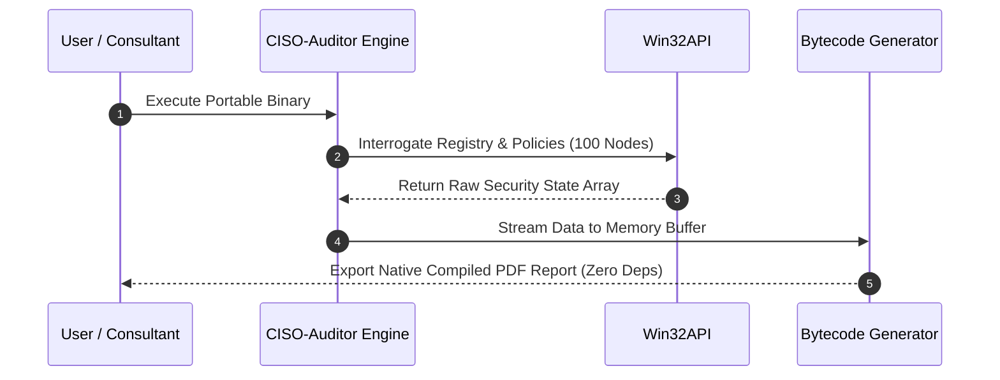
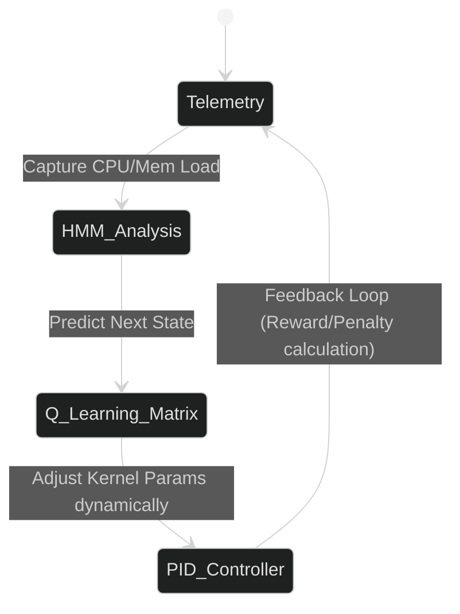
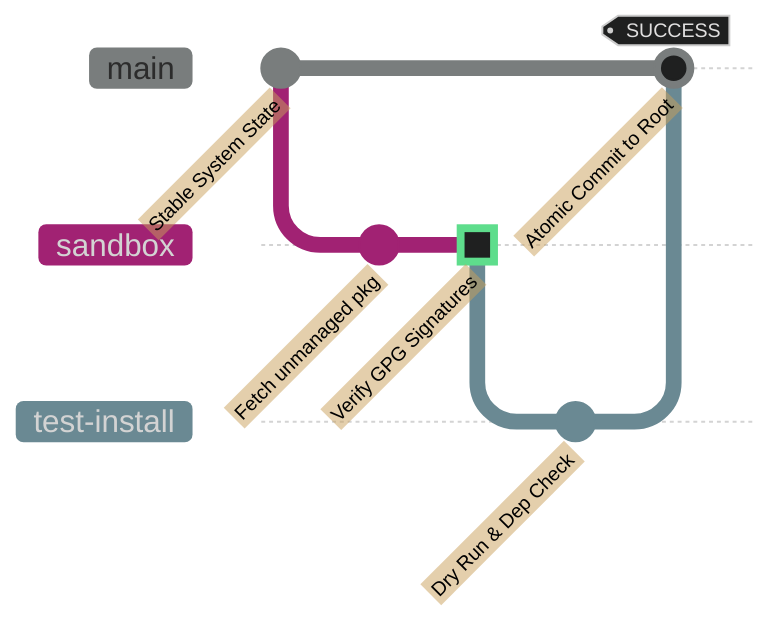

<!-- Hero Image -->

  

<!-- Simulated Terminal UI for Mission Statement -->
<table width="100%" style="border-collapse: collapse; border: 1px solid #30363d;">
  <tr style="background-color: #161b22; border-bottom: 1px solid #30363d;">
    <td align="left" style="padding: 8px 12px; font-family: monospace; color: #8b949e; font-size: 14px;">
      🔴 🟡 🟢 &nbsp; <b>theyonecodes@root:~#</b> ./execute_vision.sh
    </td>
  </tr>
  <tr style="background-color: #0d1117;">
    <td align="center" style="padding: 20px;">
      
    </td>
  </tr>
</table>

 

<!-- Bento Box Grid 1: Badges & Live Stats -->
<table width="100%" style="border: none;">
  <tr>
    <!-- Badges Column -->
    <td width="30%" align="center" valign="middle">
        
        
      
    </td>
    <!-- Stats Column -->
    <td width="35%" align="center" valign="middle">
      
    </td>
    <!-- Top Langs Column -->
    <td width="35%" align="center" valign="middle">
      
    </td>
  </tr>
</table>

---

## 🧠 The Architecture Engine

I bridge the gap between rigorous business analysis and volatile AI toolchains. Code is simply the byproduct of clear thinking. Before a repository is initialized, I deploy enterprise-grade logic to isolate the root cause, design the workflow, and deploy autonomous AI infrastructure to build the solution.

---

## 🏗️ Core Engineering Portfolio

Below are the public engines built to enforce this methodology. Every repository represents a solved bottleneck in a real-world pipeline.

 

###  [CISO-Auditor](https://github.com/theyonecodes/CISO-Auditor) · *Enterprise Windows Security Engine*

  
  
  

> **The Friction:** Compliance auditing relies on bloated `$10K/yr` software or manual consultant checklists. Stakeholders need PDF reports, but standard generation libraries require massive dependencies.
> 
> **The Architecture:** A portable, 100-point automated compliance engine. It features a hand-rolled PDF bytecode generator that builds reports bit-by-bit directly in memory, bypassing external library constraints entirely.

 

###  [archperf-pro](https://github.com/theyonecodes/archperf-pro) · *Heuristic Kernel Optimization*

  
  
  

> **The Friction:** Static optimization scripts fail to adapt to live hardware usage. They lock resources blindly, wasting CPU cycles and battery during fluctuating multi-threaded workloads.
> 
> **The Architecture:** A dynamic, pro-grade Arch Linux tuning daemon. It tracks operational behavior in real-time using Hidden Markov Models (HMM) and employs Q-Learning reinforcement loops to allocate system resources predictively.

 

###  [pkgdrop](https://github.com/theyonecodes/pkgdrop) · *Atomic Package Pipeline*

  
  
  

> **The Friction:** Installing unmanaged binaries (`deb`, `rpm`, `AppImage`) outside of system package managers shatters Linux system state and violates strict zero-trust security assumptions.
> 
> **The Architecture:** A universal, atomic installer pipeline. It forces strict GPG verification, executes in an isolated sandboxed staging area, and guarantees instant transaction rollbacks if any part of the dependency graph fails.

---

## ⚙️ Production Stack Matrix

<table width="100%" style="border-collapse: collapse; border: 1px solid #30363d; background-color: #0d1117;">
  <tr style="background-color: #161b22; border-bottom: 1px solid #30363d;">
    <th align="center" style="padding: 15px; color: #c9a05b; width: 33%;">Systems & Infrastructure</th>
    <th align="center" style="padding: 15px; color: #c9a05b; width: 34%;">AI Orchestration</th>
    <th align="center" style="padding: 15px; color: #c9a05b; width: 33%;">Execution & Design</th>
  </tr>
  <tr>
    <!-- Col 1 -->
    <td align="center" valign="top" style="padding: 20px 10px; border-right: 1px solid #30363d;">
        
      <code>Linux (Arch)</code> 
      <code>Docker / Containers</code> 
      <code>GPG Sandboxing</code>
    </td>
    <!-- Col 2 -->
    <td align="center" valign="top" style="padding: 20px 10px; border-right: 1px solid #30363d;">
         
      <code>Claude &amp; Antigravity</code> 
      <code>Token Guardrails</code> 
      <code>OpenRouter API</code>
    </td>
    <!-- Col 3 -->
    <td align="center" valign="top" style="padding: 20px 10px;">
         
      <code>IndexedDB State</code> 
      <code>Cinematic Dark UX</code> 
      <code>OKLCH Specs</code>
    </td>
  </tr>
</table>

---

  

  [ Execution Complete :: Zero Waste Protocol Active ]

