<!-- Header Banner -->

 

  

<table border="0" width="100%" style="border-collapse: collapse;">
  <tr>
    <td width="60%" valign="middle">
      
Let’s be real: Out-of-the-box software feels like it’s trying to run a marathon while carrying a backpack full of bricks. 🎒 Between bloated dependencies, background telemetry, and systems constantly second-guessing themselves, it’s a wonder we get any coding done at all.

      
I am the "Axe" to those bricks. I’m not here to just write code; I’m here to perform a <b>DNA Swap</b> on your infrastructure so it finally acts like the high-performance engine you paid for. 🏎️

      
<b>"If it's repetitive, it's a bug. If it eats 10% of your CPU for breakfast, it's malware. 🍳"</b>

    </td>
    <td width="40%" align="center" valign="middle">
      
    </td>
  </tr>
</table>

 

<!-- COMMAND CENTER -->

<table border="0" cellpadding="0" cellspacing="0" width="100%">
  <tr>
    <!-- Left Column: Core Stats -->
    <td width="60%" valign="top" align="center">
      
    </td>
    <td width="1%"></td>
    <!-- Right Column: Languages & Tech Stack -->
    <td width="39%" valign="top" align="center">
      
        
      
    </td>
  </tr>
</table>

 

<table border="0" cellpadding="0" cellspacing="0" width="100%">
  <tr>
    <td width="100%" align="center">
      
    </td>
  </tr>
</table>

 

<!-- THE INFRASTRUCTURE -->

<table border="0" cellpadding="5" cellspacing="0" width="100%">
  <tr>
    <td width="25%" align="center" valign="top">
      
       
      <h3>🧠 KERNEL & SYSTEMS</h3>
      <i>The "DNA Swap." Pinning the core to the fast lane. Telling the OS to stop hoarding background tasks like a pack-rat. 🧹</i>
    </td>
    <td width="25%" align="center" valign="top">
      
       
      <h3>🤖 AI & AUTOMATION</h3>
      <i>Orchestrating AI swarms to do the heavy lifting while your machine takes a coffee break. ☕ Minus the Skynet vibe.</i>
    </td>
    <td width="25%" align="center" valign="top">
      
       
      <h3>⚡ INTERFACE & VISION</h3>
      <i>The "Snappy" Scheduler. When you click, the UI says "Yes, sir!" immediately. 120FPS or bust.</i>
    </td>
    <td width="25%" align="center" valign="top">
      
       
      <h3>🛣️ CLOUDOPS & DATA</h3>
      <i>Direct Highway for Data. Infrastructure that doesn't eat your CPU for breakfast. Scalable, ruthless efficiency.</i>
    </td>
  </tr>
</table>

  

<!-- FEATURED PROJECT BANNER -->

  

  
    
  <b>Current Status:</b> <i>Engine Tuned. Friction Deleted. Now go build something cool.</i> 🚀

