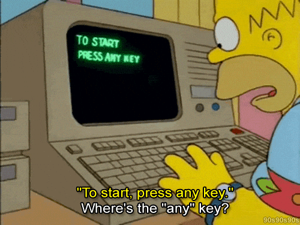

  
  
  <h1>Removing the Friction</h1>
  
  

    
  

  

    
    
    
  

 

<table border="0">
  <tr>
    <td width="60%">
      
I'm tired of software being slow for no reason. I spend my time making sure systems actually do what they're supposed to—instantly. No bloat, no nonsense, just tools that work as fast as you think. Less waiting, more doing.

      
<b>"If it's repetitive, it's a bug. If it lags, it's a problem."</b>

    </td>
    <td width="40%">
      
    </td>
  </tr>
</table>

---

## ⚡ Activity

  

  
  

---

## 🏗️ What I Build

<table border="0">
  <tr>
    <td width="50%" align="center">
      
      <h3>SYSTEMS</h3>
      
<i>Cleaning up the junk. If it's slowing you down, I'm removing it.</i>

      <code>Batch</code> • <code>Shell</code> • <code>PowerShell</code> • <code>C</code>
    </td>
    <td width="50%" align="center">
      
      <h3>AUTOMATION</h3>
      
<i>Making AI handle the boring parts so you don't have to.</i>

      <code>Python</code> • <code>FastAPI</code> • <code>LLMs</code> • <code>Agents</code>
    </td>
  </tr>
  <tr>
    <td width="50%" align="center">
      
      <h3>INTERFACES</h3>
      
<i>UIs that actually keep up with you. No lag, no jitters.</i>

      <code>TypeScript</code> • <code>React</code> • <code>Vite</code> • <code>Figma</code>
    </td>
    <td width="50%" align="center">
      
      <h3>INFRASTRUCTURE</h3>
      
<i>Reliable systems that just work and stay out of the way.</i>

      <code>Docker</code> • <code>AWS</code> • <code>Git</code> • <code>Postgres</code>
    </td>
  </tr>
</table>

---

## 🏆 Featured
*   **[Windows Super Smooth](https://github.com/theyonecodes/Windows-Super-Smooth)**: Making Windows actually respond instantly.

---

  
   
  © 2026 theyonecodes — Flow restored. Now go build something.

