<!-- 2026 BULLETPROOF HERO: CUSTOM SVG -->

 

<!-- KINETIC NEURAL TYPING -->

  

<!-- DEPTH-LAYERED INTRO -->
<table border="0" width="100%" style="border-collapse: collapse;">
  <tr>
    <td width="60%" valign="middle">
      

        
Out-of-the-box software is a marathon with a backpack full of bricks. 🎒

        
I am the <b>AXE</b>. I perform a <b>DNA Swap</b> on your infrastructure until it breathes with the high-performance rhythm of an elite machine. 🏎️

        <b><i>"If it eats 10% of your CPU for breakfast, it's malware. 🍳"</i></b>
      

    </td>
    <td width="40%" align="center" valign="middle">
      
    </td>
  </tr>
</table>

 

<!-- COMMAND CENTER STRIPE: CUSTOM GLASS SVG -->

<table border="0" cellpadding="0" cellspacing="0" width="100%">
  <tr>
    <td width="60%" valign="top" align="center">
      

        
      

    </td>
    <td width="2%"></td>
    <td width="38%" valign="top" align="center">
      

        
          
        
      

    </td>
  </tr>
</table>

 

  

 

<!-- INFRASTRUCTURE STRIPE: CUSTOM GLASS SVG -->

<table border="0" cellpadding="10" cellspacing="0" width="100%">
  <tr>
    <td width="25%" align="center" valign="top">
      

        
          
        <b>🧠 KERNEL</b>
        The DNA Swap. Pinning the core to the fast lane. No pack-rat background tasks. 🧹
      

    </td>
    <td width="25%" align="center" valign="top">
      

        
          
        <b>🤖 AI SWARM</b>
        Orchestrating agents while your machine takes a coffee break. ☕ Zero Skynet vibes.
      

    </td>
    <td width="25%" align="center" valign="top">
      

        
          
        <b>⚡ VISION</b>
        The Snappy Scheduler. Instant response. 120FPS or bust. Perfect motion.
      

    </td>
    <td width="25%" align="center" valign="top">
      

        
          
        <b>🛣️ HIGHWAY</b>
        CloudOps at scale. Infrastructure that doesn't choke. Pure efficiency.
      

    </td>
  </tr>
</table>

  

<!-- FEATURED PROJECT: GLASS BANNER -->

  

  
    
  <b>Current Status:</b> <i>Engine Tuned. Friction Deleted. Now go build something cool.</i> 🚀

